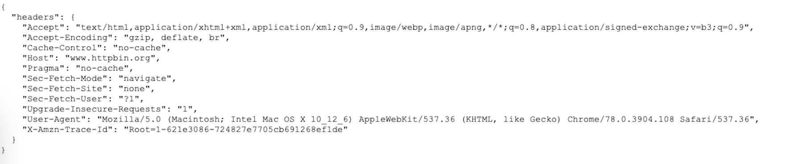

# puppeteer-js-render

- [English](https://github.com/qshine/puppeteer-js-render/blob/master/README.md)
- [中文](https://github.com/qshine/puppeteer-js-render/blob/master/README-CN.md) 

----

`puppeteer-js-render` 是一个html/js渲染器. 主要使用puppeteer和express. 你可以使用它来做网络爬虫或其它事情.

## 特性
- 支持运行自定义js脚本
- 移除浏览器指纹
- 支持截图
- 自定义headers和cookies
- ...

## 安装
```sh
# install node package
npm install
```

建议安装pm2来管理进程
```sh
npm install -g pm2

pm2 start app
pm2 stop app
pm2 logs app
pm2 list
```

## 运行
```sh
node app.js
```
服务会监听 `22222` 端口

## 参数说明
- `url`: 目标url
- `method`: Get/Post. 默认Get
- `proxy`: 给浏览器设置代理(仅支持浏览器级别). 如:127.0.0.1:1080
- `data`: 如果目标url方法是post需要设置的post参数
- `load_images`: 是否加载图片. 默认true
- `headless`: 无头模式. 默认true
- `viewport_width`: 默认 1280
- `viewport_height`: 默认 1024
- `timeout`: 请求超时时间(单位s). 默认20s
- `screenshot_name`: 截图名称(可以为空. 默认存储在当前路径), 如: test.png
- `cookies`: 自定义cookies. 如:
  ```
  [
      {
          "domain":".github.com",
          "expirationDate":1652020053,
          "hostOnly":false,
          "httpOnly":false,
          "name":"_ga",
          "path":"/",
          "sameSite":"unspecified",
          "secure":false,
          "session":false,
          "storeId":"0",
          "value":"GA1.2.792623144.1577201184",
          "id":1
      }
  ]
  ```
- `mobile`: 是否模拟移动端 默认false
- `headers`: 请求headers, 如
  ```
  {
  	"accept": "text/html",
  	"referer": "https://www.google.com/",
  	"user-agent" : "Mozilla/5.0 (Macintosh; Intel Mac OS X 10_13_2) AppleWebKit/537.36 (KHTML, like Gecko) Chrome/71.0.3578.98 Safari/537.36"
  }
  ```
- `js_script`: 目标url加载后运行的js脚本
- `sleep_time`: 目标url加载后暂停时间(单位 ms). 如:2000

## 例子
运行后端服务
`node app.js`

执行curl命令
```
curl --location --request POST '127.0.0.1:22222' \
--header 'Content-Type: application/x-www-form-urlencoded' \
--data-urlencode 'url=https://www.httpbin.org/headers' \
--data-urlencode 'js_script=function test(){
    return "hello world"
}
test()' \
--data-urlencode 'screenshot_name=eg.png'
```

响应结果
```
{"code":200,"err_msg":null,"time":2160,"data":{"input_url":"https://www.httpbin.org/headers","final_url":"https://www.httpbin.org/headers","headers":{"status":"200","date":"Tue, 01 Mar 2022 14:41:10 GMT","content-type":"application/json","content-length":"648","server":"gunicorn/19.9.0","access-control-allow-origin":"*","access-control-allow-credentials":"true"},"all_cookies":[],"content":"<html><head></head><body><pre style=\"word-wrap: break-word; white-space: pre-wrap;\">{\n  \"headers\": {\n    \"Accept\": \"text/html,application/xhtml+xml,application/xml;q=0.9,image/webp,image/apng,*/*;q=0.8,application/signed-exchange;v=b3;q=0.9\", \n    \"Accept-Encoding\": \"gzip, deflate, br\", \n    \"Cache-Control\": \"no-cache\", \n    \"Host\": \"www.httpbin.org\", \n    \"Pragma\": \"no-cache\", \n    \"Sec-Fetch-Mode\": \"navigate\", \n    \"Sec-Fetch-Site\": \"none\", \n    \"Sec-Fetch-User\": \"?1\", \n    \"Upgrade-Insecure-Requests\": \"1\", \n    \"User-Agent\": \"Mozilla/5.0 (Macintosh; Intel Mac OS X 10_12_6) AppleWebKit/537.36 (KHTML, like Gecko) Chrome/78.0.3904.108 Safari/537.36\", \n    \"X-Amzn-Trace-Id\": \"Root=1-621e3086-724827e7705cb691268ef1de\"\n  }\n}\n</pre></body></html>","js_script_result":"hello world"}}
```

below is the screenshot


## TODO
- [ ] Dockerfile
